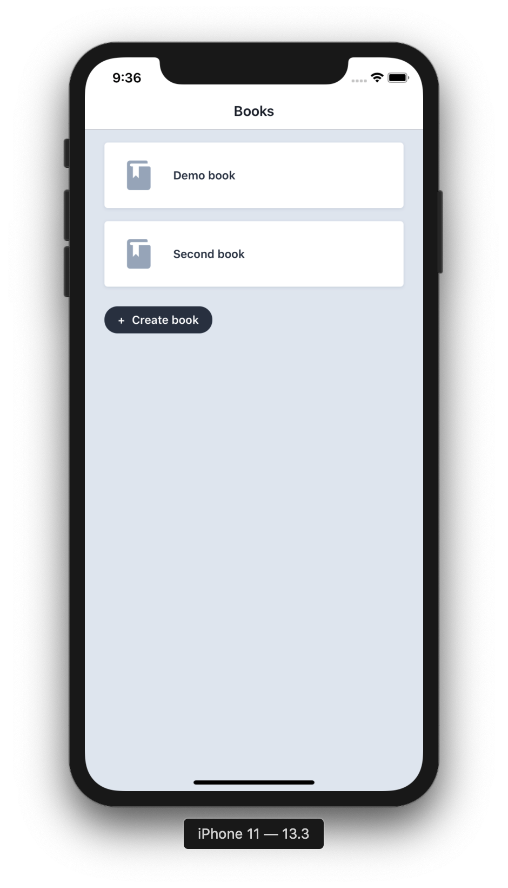
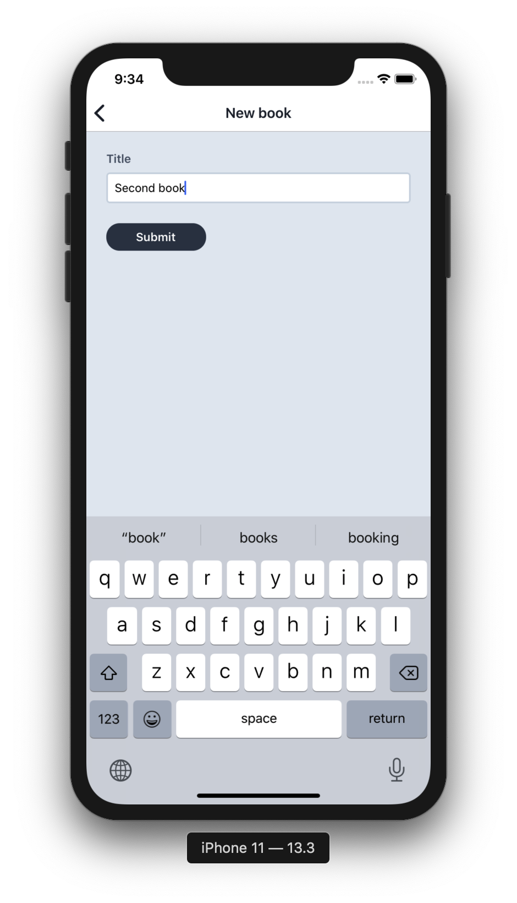
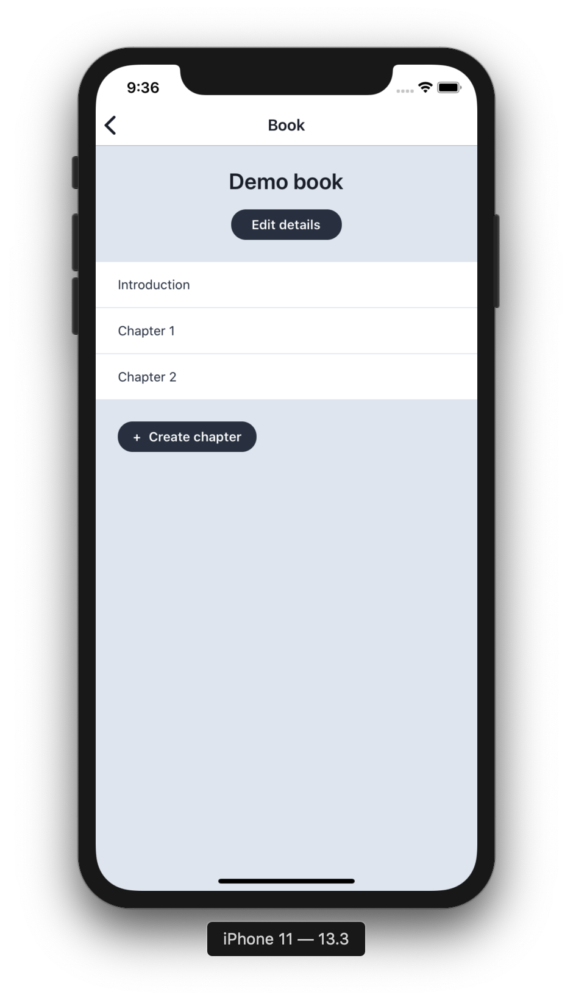
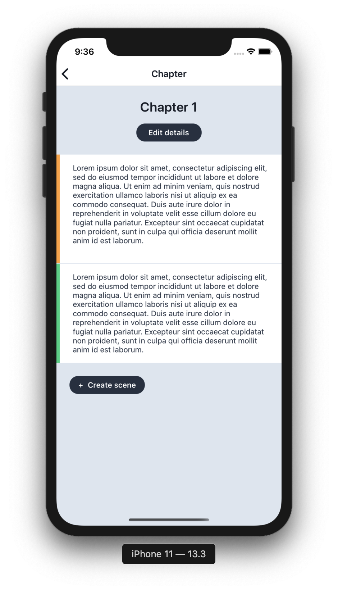
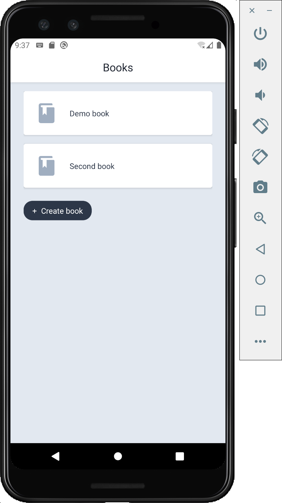
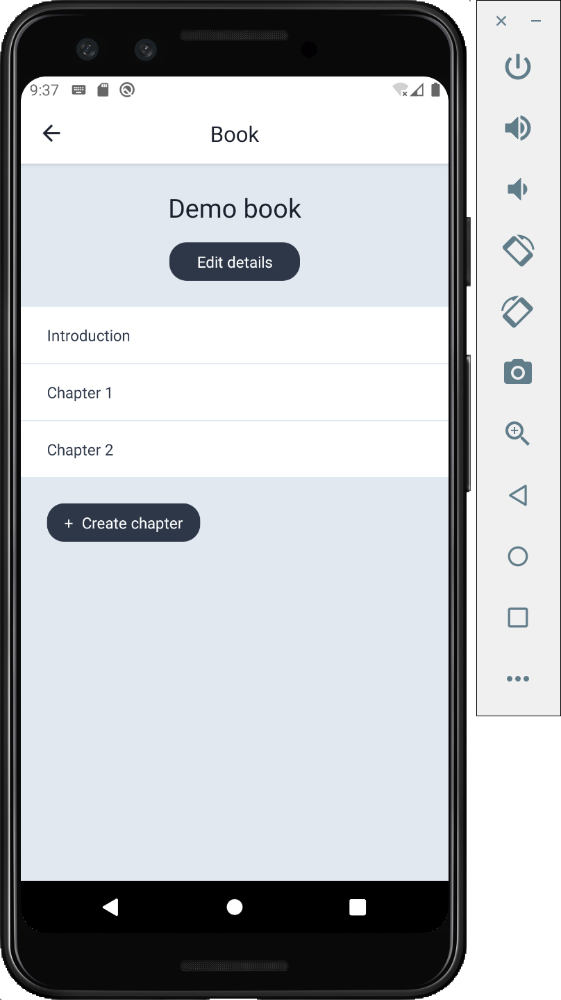
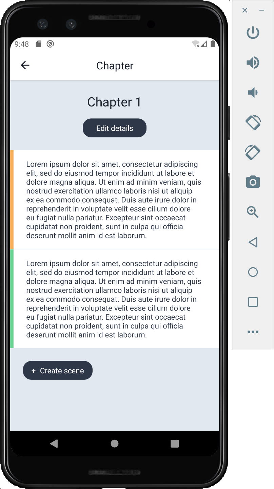
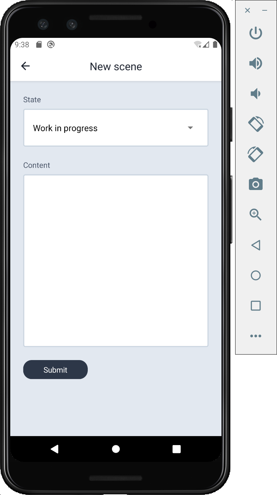

# BookDraft app

Write your book on the go!

## Install

```bash
yarn install
cd ios && pod install && cd -
```

## Run

```bash
yarn <ios | android>
```

## Storybook

Switch imports in `index.js` and restart it.

## Description

The idea of this app is to allow users to write book chapters in chunks - short scenes which can be edited separately. 
Each scene can be marked as 'Work in progress', 'Done' or 'Idea / TODO' to track the progress.

## Current functionality

- [x] Written in TypeScript with React Native, Redux Toolkit, React Navigation
- [x] Works offline. Persists data in local SQlite DB
- [x] Supports CRUD operations for books
- [x] Supports CRUD operations for chapters
- [x] Supports CRUD operations for chapter scenes
- [x] Has 6 screens
- [x] Has Storybook to showcase React components

## Next steps

- [ ] Improve UI/UX
- [ ] Add context menu actions for books, chapters, scenes: share, export, move to... etc
- [ ] Allow reordering of chapters and scenes
- [ ] Visualize the progress of writing a book/chapter based on the existing scenes statuses
- [ ] Test the connection to SQLite DB properly and might be switch to another storage type (e.g. use an API) 
- [ ] Backups if the app stays offline only
- [ ] Write tests for reducers

## Screenshots

### iOS






### Android





